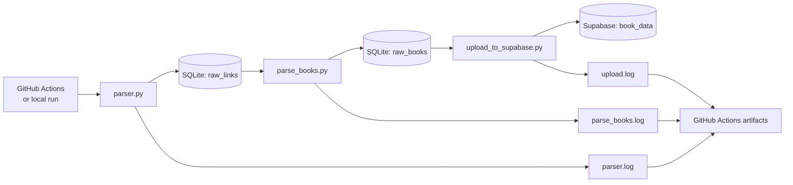

# Vivat ETL

[](https://github.com/Revo69/vivat-etl/actions/workflows/etl.yml)


ETL pipeline that collects book pages from [vivat.com.ua](https://vivat.com.ua), extracts structured book metadata, stores processing state in SQLite, and upserts validated records into Supabase.

The project demonstrates a compact, production-oriented data workflow built with Python, Selenium, Beautiful Soup, SQLite, Supabase, and GitHub Actions.

## Overview

Vivat ETL processes data in three stages:

1. **Extract links** — collect book URLs from the Vivat catalogue.
2. **Extract metadata** — parse individual book pages and store normalized fields in SQLite.
3. **Load data** — upload new records to Supabase using ISBN as the natural key.

SQLite acts as the pipeline's local state store. It tracks discovered links, processed pages, parsed books, and upload status, allowing repeated runs to skip already completed work.

## Architecture



## Pipeline stages

### 1. Link collection

`etl/parser.py`:

- opens the Vivat fiction catalogue with headless Chrome;
- scans up to five catalogue pages;
- removes URL query parameters;
- deduplicates links in memory;
- inserts only previously unseen URLs into `raw_links`.

The `url` column is unique, so rerunning this stage is idempotent for already discovered pages.

### 2. Book metadata extraction

`etl/parse_books.py`:

- selects links where `processed = 0`;
- requests each book page;
- extracts metadata from the characteristics section;
- requires both `title` and `isbn`;
- upserts books into `raw_books` by ISBN;
- marks successfully parsed source links as processed.

Extracted fields include:

- title;
- author;
- series;
- publisher;
- page count;
- cover type;
- publication year;
- translator;
- language;
- ISBN.

### 3. Supabase upload

`etl/upload_to_supabase.py`:

- selects records where `uploaded = 0`;
- upserts them into the Supabase `book_data` table;
- uses ISBN as the conflict key;
- marks successfully uploaded SQLite records as complete.

This makes repeated upload runs safe for records already present in Supabase.

## Technology stack

| Component | Purpose |
|---|---|
| Python 3.11 | Pipeline implementation |
| Selenium | Rendering JavaScript-driven catalogue pages |
| Beautiful Soup | HTML parsing |
| Requests | Fetching individual book pages |
| SQLite | Local state and staging storage |
| Supabase / PostgreSQL | Destination data store |
| GitHub Actions | Scheduled orchestration |
| GitHub Actions artifacts | Log retention and troubleshooting |

## Repository structure

```text
vivat-etl/
├── .github/
│   └── workflows/
│       └── etl.yml
├── db/
│   └── books_links.sqlite3
├── etl/
│   ├── config.py
│   ├── parser.py
│   ├── parse_books.py
│   └── upload_to_supabase.py
├── logs/
│   ├── parser.log
│   ├── parse_books.log
│   └── upload.log
├── requirements.txt
└── README.md
```

The SQLite database and generated logs are runtime artifacts and should not be committed to source control.

## Local setup

### Prerequisites

- Python 3.11 or newer;
- Google Chrome or Chromium;
- access to a Supabase project;
- a Supabase key with permission to upsert into `book_data`.

### Installation

```bash
git clone https://github.com/Revo69/vivat-etl.git
cd vivat-etl

python -m venv .venv
```

Activate the virtual environment.

**Linux/macOS**

```bash
source .venv/bin/activate
```

**Windows PowerShell**

```powershell
.venv\Scripts\Activate.ps1
```

Install dependencies:

```bash
python -m pip install --upgrade pip
pip install -r requirements.txt
```

### Environment variables

Create a `.env` file in the repository root:

```env
SUPABASE_URL=https://your-project.supabase.co
SUPABASE_KEY=your-supabase-key
```

Do not commit `.env` or expose a service-role key in application code, logs, issues, or workflow output.

## Running the pipeline

Run all stages from the repository root and in this order:

```bash
python etl/parser.py
python etl/parse_books.py
python etl/upload_to_supabase.py
```

You can also execute a single stage while debugging:

```bash
python etl/parser.py
```

```bash
python etl/parse_books.py
```

```bash
python etl/upload_to_supabase.py
```

## Data model

### `raw_links`

Tracks source URLs and parsing progress.

```sql
CREATE TABLE IF NOT EXISTS raw_links (
    id INTEGER PRIMARY KEY AUTOINCREMENT,
    url TEXT NOT NULL UNIQUE,
    processed BOOLEAN DEFAULT 0,
    created_at TIMESTAMP DEFAULT CURRENT_TIMESTAMP,
    updated_at TIMESTAMP
);
```

### `raw_books`

Stores extracted book metadata and upload state.

```sql
CREATE TABLE IF NOT EXISTS raw_books (
    id INTEGER PRIMARY KEY AUTOINCREMENT,
    link_id INTEGER NOT NULL,
    title TEXT NOT NULL,
    author TEXT DEFAULT '',
    seria TEXT DEFAULT '',
    publisher TEXT DEFAULT '',
    pages_count INTEGER DEFAULT 0,
    cover_type TEXT DEFAULT '',
    publication_year INTEGER DEFAULT 0,
    translator TEXT DEFAULT '',
    book_language TEXT DEFAULT '',
    isbn TEXT NOT NULL UNIQUE,
    created_at TIMESTAMP DEFAULT CURRENT_TIMESTAMP,
    uploaded BOOLEAN DEFAULT 0,
    FOREIGN KEY (link_id) REFERENCES raw_links(id)
);
```

### Supabase destination

The loader expects a table named `book_data` with columns matching the outgoing payload:

```text
author
title
seria
publisher
pages_count
cover_type
publication_year
translator
book_language
isbn
```

The `isbn` column should have a unique constraint because it is used as the upsert conflict key.

## Automation

The GitHub Actions workflow is defined in `.github/workflows/etl.yml`.

It runs:

- every day at **07:00 UTC**;
- manually through `workflow_dispatch`.

The workflow:

1. checks out the repository;
2. installs Python 3.11;
3. installs dependencies;
4. runs the three ETL stages;
5. uploads the generated `logs/` directory as a workflow artifact.

Required repository secrets:

```text
SUPABASE_URL
SUPABASE_KEY
```

> GitHub-hosted runners are ephemeral. The current workflow does not persist the generated SQLite database between runs. For reliable scheduled incremental processing, the pipeline state should eventually be moved to persistent storage or explicitly restored and saved as an artifact.

## Logging and troubleshooting

Each stage writes to both the console and a dedicated file:

| Stage | Log file |
|---|---|
| Link collection | `logs/parser.log` |
| Metadata extraction | `logs/parse_books.log` |
| Supabase upload | `logs/upload.log` |

On GitHub Actions, logs are uploaded as an artifact named similar to:

```text
vitat-etl-logs-<run_id>
```

Common checks:

- **No links found:** the Vivat HTML structure or generated CSS classes may have changed.
- **Books skipped:** verify that the page still exposes both title and ISBN.
- **Supabase upload fails:** check `SUPABASE_URL`, `SUPABASE_KEY`, table permissions, column names, and the ISBN unique constraint.
- **Chrome fails locally:** confirm that Chrome or Chromium is installed and compatible with Selenium.

## Current limitations

- Selectors depend on generated CSS class names from the source website and may break after frontend changes.
- The catalogue stage currently scans only five pages.
- Parsing and uploading are sequential.
- Retries and exponential backoff are not yet implemented.
- SQLite state is local and is not persisted by the current GitHub-hosted workflow.
- Automated tests and explicit data-quality checks are not yet included.

## Roadmap

- replace fragile generated-class selectors with more stable selectors where possible;
- add request retries, timeouts, and exponential backoff;
- add schema and data-quality validation before loading;
- add unit tests for parsing and transformation logic;
- persist pipeline state outside the ephemeral GitHub Actions runner;
- add run metrics such as discovered, parsed, skipped, and uploaded records;
- support configurable catalogue categories, page limits, and backfills;
- pin and regularly update dependency versions.

## Security

- Keep Supabase credentials in `.env` locally and GitHub Secrets in CI.
- Never expose the service-role key to frontend applications.
- Apply least-privilege access to the destination table.
- Enable Row Level Security where appropriate for application-facing access.
- Rotate credentials immediately if they are committed or printed publicly.

## Author

Maintained by [Serghei / Revo69](https://github.com/Revo69).

## License

No license file is currently present in the repository. Add a `LICENSE` file before declaring the project available under a specific open-source license.
