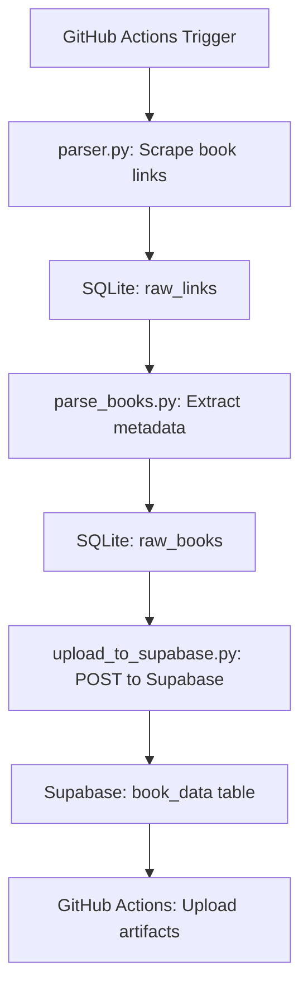

# 📚 Vivat ETL

[](https://github.com/Revo69/vivat-etl/actions/workflows/etl.yml)

An automated ETL pipeline for collecting book links and metadata from [vivat.com.ua](https://vivat.com.ua), storing them in SQLite, and uploading structured data to Supabase.

---

## 🚀 Features

- Daily scraping of new book URLs
- Metadata extraction (title, author, ISBN, etc.)
- Storage in SQLite (`raw_links`, `raw_books`)
- Upload to Supabase via secure API
- GitHub Actions automation with logging and artifact export
- Secrets managed via GitHub for security

---

## 🧱 Project Structure

```
vivat-etl/
├── .github/workflows/
│   └── etl.yml              # GitHub Actions workflow
├── etl/
│   ├── parser.py            # Collects book links
│   ├── parse_books.py       # Extracts book metadata
│   ├── upload_to_supabase.py# Uploads data to Supabase
│   ├── config.py            # Centralized paths and settings
├── db/
│   └── books_links.sqlite3  # SQLite database
├── requirements.txt         # Python dependencies
└── README.md                # Project documentation
```

---

## ⚙️ Local Setup

1. Install dependencies:
   ```bash
   pip install -r requirements.txt
   ```

2. Create `.env` file in project root:
   ```env
   SUPABASE_URL=https://your-project.supabase.co
   SUPABASE_KEY=your-service-role-key
   ```

3. Run the pipeline manually:
   ```bash
   python etl/parser.py
   python etl/parse_books.py
   python etl/upload_to_supabase.py
   ```

---

## 🗃️ SQLite Table Schemas

### `raw_links`

```sql
CREATE TABLE IF NOT EXISTS raw_links (
    id INTEGER PRIMARY KEY AUTOINCREMENT,
    url TEXT NOT NULL UNIQUE,
    processed BOOLEAN DEFAULT 0,
    created_at TIMESTAMP DEFAULT CURRENT_TIMESTAMP,
    updated_at TIMESTAMP
);
```

### `raw_books`

```sql
CREATE TABLE IF NOT EXISTS raw_books (
    id INTEGER PRIMARY KEY AUTOINCREMENT,
    link_id INTEGER NOT NULL,
    title TEXT NOT NULL,
    author TEXT DEFAULT '',
    seria TEXT DEFAULT '',
    publisher TEXT DEFAULT '',
    pages_count INTEGER DEFAULT 0,
    cover_type TEXT DEFAULT '',
    publication_year INTEGER DEFAULT 0,
    translator TEXT DEFAULT '',
    book_language TEXT DEFAULT '',
    isbn TEXT NOT NULL UNIQUE,
    created_at TIMESTAMP DEFAULT CURRENT_TIMESTAMP,
    uploaded BOOLEAN DEFAULT 0,
    FOREIGN KEY (link_id) REFERENCES raw_links(id)
);
```

---

## 🕰️ GitHub Actions Automation

The workflow runs:

- ⏰ Daily at 6:00 AM UTC (`cron`)
- 🧑‍💻 Manually via GitHub interface (`workflow_dispatch`)

It performs:

- Link scraping (`parser.py`)
- Metadata parsing (`parse_books.py`)
- Upload to Supabase (`upload_to_supabase.py`)
- Commits updated SQLite DB
- Uploads logs as artifacts for inspection

---

## ☁️ Supabase Integration

Vivat ETL securely uploads parsed book metadata to a Supabase table (`book_data`) using the **service-role API key**.

- ✅ Uses `SUPABASE_URL` and `SUPABASE_KEY` from `.env` or GitHub Secrets
- ✅ Uploads only validated records with non-empty `title` and `isbn`
- ✅ Automatically marks uploaded records with `uploaded = true` in SQLite

Supabase REST API is accessed via:

```http
POST https://your-project.supabase.co/rest/v1/book_data
Authorization: Bearer <service-role-key>
Content-Type: application/json
```

---

## 🔐 Row-Level Security (RLS)

To ensure secure access, **Row-Level Security (RLS)** is enabled on all Supabase tables.

- ✅ `book_data` allows `INSERT` only for `service_role` via policy:
  ```sql
  CREATE POLICY "Allow insert for service role"
  ON book_data
  FOR INSERT
  TO service_role
  WITH CHECK (true);
  ```
- ❌ Other roles (`anon`, `authenticated`) cannot insert into `book_data`
- ✅ Other tables (`user`, `profile`, `book_post`) are protected and accessible only to backend

This ensures GitHub Actions can write safely, while frontend/backend access remains isolated.

---

## ⚙️ GitHub Actions Logging & Artifacts

Each ETL run is fully logged and traceable via GitHub Actions:

- 📅 Runs daily at 6:00 UTC or manually via `workflow_dispatch`
- 📦 Uploads logs as artifacts:
  - `parser.log` — link scraping
  - `parse_books.log` — metadata parsing
  - `upload.log` — Supabase upload status

Example artifact upload step:

```yaml
- name: 📎 Upload logs as artifacts
  uses: actions/upload-artifact@v4
  with:
    name: etl-logs-${{ github.run_id }}
    path: logs/
```

Artifacts are downloadable from the workflow run page for debugging and auditing.

---

## 📊 Pipeline Architecture



---

## 📌 Future Plans

- Add data quality checks before upload
- Enable concurrent backfills for historical data
- Visualize upload progress and metrics
- Integrate with dashboards or BI tools

---

## 👤 Author

Developed and maintained by [Serghei](https://github.com/Revo69) — passionate about Data Engineering and clean architecture.

---

## 🛡️ License

MIT License — feel free to use, modify, and share.
